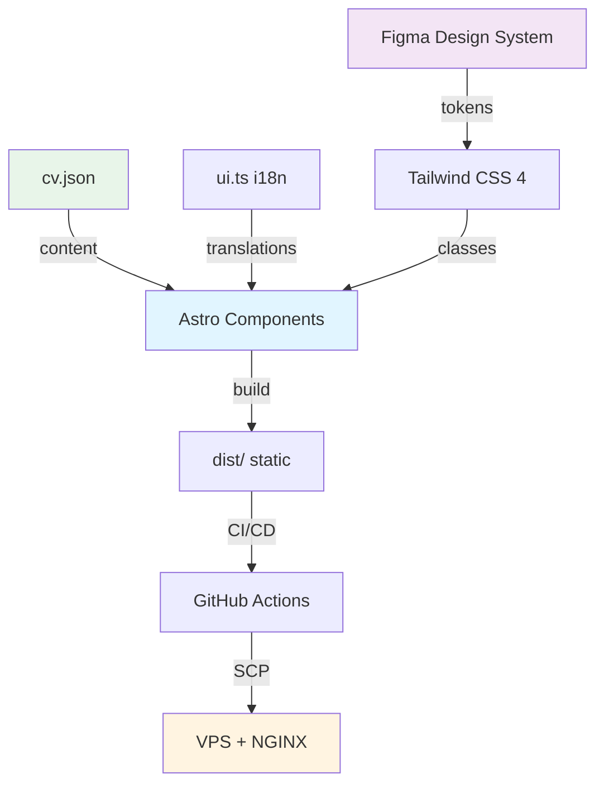

# 🎯 Curriculum — Portfolio Profissional

**Portfolio e CV multilíngue de Thales Ferreira** — Full Stack Data Engineer | Python & ML | DevOps Specialist. Site estático de alta performance com design system integrado ao Figma.

[](https://github.com/thalesfb/curriculum/actions/workflows/ci.yml)
[](https://github.com/thalesfb/curriculum/actions/workflows/build.yml)
[](https://astro.build)
[](https://tailwindcss.com)

> 🔗 **Quick Navigation**: [Live](#-links) • [Quick Start](#-quick-start) • [Architecture](#️-architecture) • [Documentation](#-documentation)

---

## 🔗 Links

| Resource | URL |
| -------- | --- |
| **Live** | [thalesfb.curriculum.optimizr.site](https://thalesfb.curriculum.optimizr.site) |
| **Design** | [Figma](https://www.figma.com/design/UXq2erOANKQqaWegZQ9nk1/CV?node-id=0-1&m=dev) |
| **Design Guide** | [Figma Design System](docs/guides/figma-design-system.md) |
| **Repository** | [github.com/thalesfb/curriculum](https://github.com/thalesfb/curriculum) |

---

## 🛠️ Technology Stack

| Layer | Technology | Details |
| ----- | ---------- | ------- |
| Framework | **Astro 6.1** | Zero JS default, static output |
| Styling | **Tailwind CSS 4** | CSS custom properties, class-based dark mode |
| Interactivity | **Vanilla JS** | CSS-first, JS only when needed |
| i18n | **Astro Routing** | PT / EN / ES with prefix routing |
| Data | **cv.json** | Single source of truth for all CV content |
| Testing | **Vitest** | 37 unit tests (i18n, data, build) |
| Design | **Figma** | Variables, components, light/dark themes |
| Deploy | **GitHub Actions** | Build → SCP to VPS → NGINX |
| Infrastructure | **VPS + NGINX** | HTTPS, HSTS, CSP headers |

---

## ✨ Features

- 🌍 **Multilíngue** — PT, EN, ES com routing automático e i18n completo
- 🎨 **Design System** — Figma → CSS Custom Properties → Tailwind (nunca hardcoded)
- 🌙 **Dark Mode** — Toggle manual, class-based (Tailwind CSS 4)
- 🔍 **Search** — Filtro em tempo real de projetos e serviços
- 👔 **5 Roles** — Data Engineer, Backend, DevOps, Management, Frontend (auto-rotação)
- 📱 **Responsive** — Desktop (1440px), Tablet (1024px), Mobile (375px)
- ♿ **Acessível** — ARIA labels, skip-to-content, focus-visible, prefers-reduced-motion
- 🔒 **Seguro** — CSP, HSTS, X-Content-Type-Options, Referrer-Policy
- 📊 **SEO** — Open Graph, hreflang, JSON-LD, sitemap, canonical URLs
- ⚡ **Performance** — Zero JS default, lazy loading, optimized images

---

## 🚀 Quick Start

### Prerequisites

- Node.js 22+
- npm

### Development

```bash
git clone https://github.com/thalesfb/curriculum.git
cd curriculum
npm install
npm run dev        # http://localhost:4321
```

### Scripts

| Command | Description |
| ------- | ----------- |
| `npm run dev` | Dev server with hot reload |
| `npm run build` | Static build → `dist/` |
| `npm run preview` | Preview production build |
| `npm test` | Run 37 Vitest tests |
| `npm run test:watch` | Tests in watch mode |
| `python generate_cvs.py` | Generate 12 CV markdowns (5 roles × 3 langs) |

---

## 🏗️ Architecture



### Data Flow

```text
Figma (design) → CSS Custom Properties → Tailwind classes → Astro components
cv.json (data)  → Hero, About, Services, Projects → Pages (/pt/, /en/, /es/)
ui.ts (labels)  → All UI text → Translated per language
```

### Deploy Pipeline

```text
Push to main → GitHub Actions (npm test + npm build) → SCP dist/ → VPS → NGINX (HTTPS)
```

---

## 📁 Project Structure

```text
curriculum/
├── .github/workflows/     CI/CD pipelines (ci, build, release)
├── data/cv.json           Single source of truth for CV content
├── docs/
│   ├── adr/               9 Architecture Decision Records
│   ├── guides/            Figma design system guide
│   ├── DEPLOYMENT.md      Deploy & NGINX docs
│   ├── DEVELOPMENT.md     Dev setup & workflows
│   └── SECURITY.md        Security practices
├── public/
│   ├── icons/             Tech skill icons (SVG)
│   ├── img/               UI icons + profile photo
│   ├── logos/             Brand logos (IFC, SENAI, Alura, Red Hat, AWS, Cisco)
│   └── refs/              CV PDFs (PT, EN, ES)
├── src/
│   ├── __tests__/         Build + CV data tests
│   ├── components/        7 Astro components
│   ├── i18n/              ui.ts + utils.ts + tests
│   ├── layouts/           BaseLayout (SEO, OG, JSON-LD)
│   ├── middleware.ts      Security headers
│   ├── pages/             index + /pt/ /en/ /es/
│   └── styles/            Design tokens + global CSS
├── AGENTS.md              AI agent governance
├── astro.config.mjs       Astro + sitemap config
└── package.json           Scripts + dependencies
```

---

## 📚 Documentation

| Doc | Content |
| --- | ------- |
| [AGENTS.md](AGENTS.md) | AI agent governance & project rules |
| [docs/adr/](docs/adr/) | 9 Architecture Decision Records |
| [docs/guides/figma-design-system.md](docs/guides/figma-design-system.md) | Figma design system guide |
| [docs/DEVELOPMENT.md](docs/DEVELOPMENT.md) | Dev setup & workflows |
| [docs/DEPLOYMENT.md](docs/DEPLOYMENT.md) | CI/CD & NGINX config |
| [docs/SECURITY.md](docs/SECURITY.md) | Security practices |

---

## 🧪 Testing

```bash
npm test             # 37 tests across 4 files
npm run test:watch   # Watch mode
```

| Test File | Tests | Coverage |
| --------- | ----- | -------- |
| `i18n/utils.test.ts` | 15 | getLangFromUrl, useTranslations, useTranslatedPath |
| `i18n/ui.test.ts` | 6 | Key parity PT/EN/ES, no empty strings |
| `cv-data.test.ts` | 7 | Schema validation, meta, roles, languages |
| `build.test.ts` | 9 | Page generation, lang attrs, OG tags, sitemap |

---

## 🎨 Design Principles

- **KISS** — HTML/CSS first, JS only when needed
- **YAGNI** — Don't build it until you need it
- **DRY** — Single source of truth (`cv.json`, `ui.ts`, CSS custom properties)
- **Clean Code** — Meaningful names, small functions, no dead code
- **Design-First** — Figma → CSS tokens → Tailwind → Code (never hardcoded colors)

---

## 📄 License

Copyright 2026 Thales Ferreira. All rights reserved.
